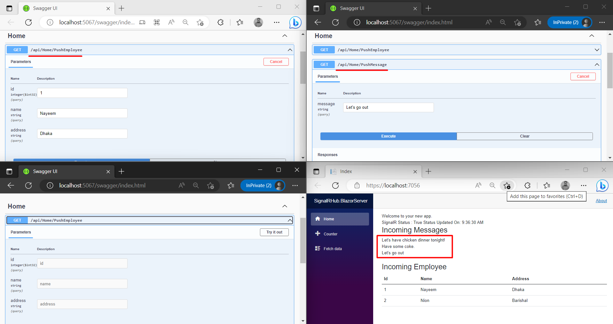

# SignalR Broadcast

This is just a dummy project to implement SignalR and its functionality. Here, we implemented `SignalR` in a .NET 6 `Web API` project. On the other hand, we implemented `Blazor Server`. 

## Demo

 

## Documentation

This project consists of two apps. 

`SignalRHub.WebAPI` : This is a Web API project. Here, for broadcasting `string` messages we created a `SignalHub`.

NuGet Package: [Microsoft.AspNetCore.SignalR](https://www.nuget.org/packages/Microsoft.AspNetCore.SignalR/1.1.0?_src=template)

`SignalRHub.BlazorServer` : This blazor server app shows the responses and the list of the subscribers.

NuGet Package: [Microsoft.AspNetCore.SignalR.Client](https://www.nuget.org/packages/Microsoft.AspNetCore.SignalR.Client/6.0.2?_src=template)

## Support

❤️ If you do like my work, hit the ⭐️ button above. ❤️

